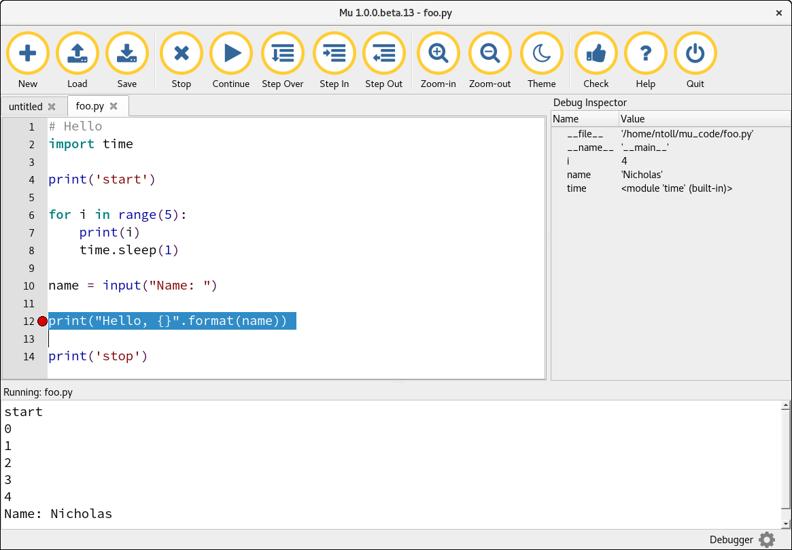

Python Runner/Debugger
======================

An obvious requirement for a Python editor is to run your Python code. For
standard Python, Mu does this in two ways:

* With the Python runner (press the "Run" button).
* With the graphical debugger (click the "Debug" button).

.. note::

    For MicroPython based modes, the code is run on the attached embedded
    device and not directly by Mu. For example, saving your code on an
    Adafruit board restarts the device and Circuit Python evaluates your
    code.

Both the Python runner and graphical debugger were created with the financial
support of the Raspberry Pi Foundation.

If you are creating a new standard Python mode for Mu, you should *at least*
make available the Python runner (please see :doc:`modes` for more information
about how to do this).

Both methods of running Python code essentially work in the same way: they
fire up a new child process and connect its stdin, stdout, stderr to the 
``PythonProcessPane`` found in the ``mu.interface.panes`` namespace so you're
able to interact with it in a terminal like environment.

However, the Python runner starts immediately whereas the debugger has to
set up a bunch of debug-related scaffolding, which makes it start slower. This
is especially noticeable on the less powerful Raspberry Pi machine. Basically,
if you just want to run your script, use the Python runner.

Python Runner
+++++++++++++

The essentials of the Python runner are in the afore mentioned
``PythonProcessPane`` class. The ``start_process`` method is used to create the
new child process. The resulting process becomes a ``process`` attribute on the
instance of the ``PythonProcessPane``.

You have some control over how the child process behaves.

* You should supply the ``script_name`` to run.
* You must also provide a ``working_directory`` within which the script will
  run (this is usually the user's ``mu_code`` directory).
* The ``interactive`` flag (which defaults to ``True``) will mean the user
  will drop into a simple Python REPL when the script completes. The default
  is at the request of the Raspberry Pi Foundation who explain that it is
  often handy for beginner developers to run their script and then explore the
  resulting context interactively.
* If the ``debugger`` flag is set to ``True`` (the default is ``False``) then
  the debug runner (see below) is started in a child process for the referenced
  script. This overrides the ``interactive`` flag to being ``False``.
* Any ``command_args`` for the referenced script should be a list of strings.
  The default is no ``command_args`` (i.e. None).

Handlers are configured to handle various events, such as when the process
finishes or when a user type a character.

The ``PythonProcessPane`` includes basic command history and input editing
features. It'll also respond to CTRL-C and CTRL-D. Copy and paste can be
accessed via a context menu.

Graphical Debugger
++++++++++++++++++

The graphical debugger exists to give beginner programmers an easy way to
observe their code while it is running and allows you to use breakpoints, step
over and into code as well as use a simple object inspector to view the status
of objects in scope.

When a user clicks the "Debug" button Mu transitions to "debug" mode which
exposes the functionality of the debugger client which, in turn, communicates
with the debug runner process which is actually driving the user's script.

The debugger is designed to be as simple as possible in order to introduce
beginner programmers to the basic concepts of a debugger in the easiest way. It
does **NOT** strive to be extensive or particularly powerful. Rather, its aim
is to encourage beginner programmers to explore their code while it is running.

In this sense if conforms to the Mu outlook of providing the first steps for a
beginner programmer with a view to them quickly graduating to a "proper"
development environment once they've found their feet.

Most of the debugger's functionality can be found in the ``mu.debugger``
namespace. Coordination is done in the ``mu.modes.debugger.DebugMode`` class.

Debug Client
------------

The debug client exists within the Mu process. It spins up an instance of
the ``mu.debugger.client.CommandBufferHandler`` class in a separate thread to
handle inter-process communication in a non-blocking manner, so the UI thread
is never blocked.

The ``mu.debugger.client.Debugger`` class is used to react to incoming events
from, and as an API for Mu to issue commands to the debug runner. It uses a
reference to a ``view`` object to update the user interface as events are
detected.

Debug Runner
------------

The debug runner exists on a new child process and makes use of Python's
`bdb debugger framework <https://docs.python.org/3/library/bdb.html>`_. It
spins up a new thread to run the ``command_buffer`` function that listens for
incoming commands.

The most interesting aspects of the runner are found in the
``mu.debugger.runner.Debugger`` class which inherits from the ``bdb.Bdb`` class
found in Python's standard library. It responds to commands from the client
and sends messages when various events occur during the debugging process.
These messages are picked up by the debug client and reflected in Mu's UI.

The ``mu.debugger.runner.run`` function is the entry point for the debug
runner and, as specified in Mu's ``setup.py``, is accessed via the ``mu-debug``
command. This command expects at least one argument: the name of the script
to be debugged. Any further arguments are passed on to the script to be
debugged.
