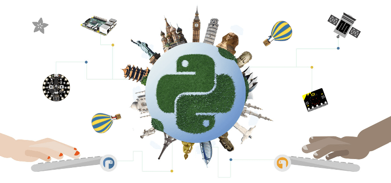

.. mu documentation master file, created by
   sphinx-quickstart on Thu Dec 24 16:24:33 2015.
   You can adapt this file completely to your liking, but it should at least
   contain the root `toctree` directive.

Mu: A Python Code Editor
========================

.. note::

    **This documentation is NOT for users of Mu**. Rather, it is for software
    developers who want to improve Mu. Read our :doc:`setup` documentation for
    the technical details needed to get started.

    For tutorials, how-to guides and user related discussion, please see the
    project's website for users of Mu at: https://codewith.mu/

    If you're interested in the fun, educational, inspiring and sometimes
    hilarious ways in which people use Mu, check out: https://madewith.mu/

Quickstart
----------

Mu works with Python 3.6 or above.

Clone the repository::

    git clone https://github.com/mu-editor/mu.git

(Recommended) Upgrade local pip::

    pip install --upgrade pip

Make a virtualenv, then install the requirements::

    pip install -e ".[dev]"

Start Mu::

    python run.py

Run the test suite::

    make check

Read on to learn more about Mu, its aims and how you can contribute.

What?
-----

Mu is a very simple Python editor for kids, teachers and beginner programmers.
It's written in Python and works on Windows, OSX, Linux and Raspberry Pi.

    "[Papert] realized, 'Oh, we could take the real content out here as a
    version in the child's world that is still the real thing.' It's not a fake
    version of math. It's kind of like little league, or even T-ball. In sports
    they do this all the time. In music, they do it all the time. The idea is,
    you never let the child do something that isn't the real thing -- but you
    have to work your ass off to figure out what the real thing is in the
    context of the way their minds are working at that developmental level."
    -- `Alan Kay <https://www.fastcompany.com/40435064/what-alan-kay-thinks-about-the-iphone-and-technology-now>`_

Mu aspires to be "the real thing" as a development environment for beginner
programmers taking their first steps with Python.

As a rule of thumb, if you're able to ask "why doesn't Mu have [feature X]?"
then you're probably too advanced for using Mu as a development environment. In
which case, you should graduate to a more advanced editor.

Why?
----

There isn't a cross platform Python code editor that is:

* Easy to use;
* Available on all major platforms;
* Well documented (even for beginners);
* Simply coded;
* Currently maintained; and,
* Thoroughly tested.

Mu addresses these needs.

Mu was originally created as a contribution from the
`Python Software Foundation <http://python.org/psf>`_
for the BBC's `micro:bit project <http://microbit.org/>`_. Many people asked if
Mu could be turned into a generic beginner's code editor and, thanks to the
wonderful support of the `Raspberry Pi Foundation <http://raspberrypi.org/>`_
the work needed to make such changes was done over the summer of 2017.

The following video of a talk given at `PyCon 2018 <https://us.pycon.org/2018/>`_
outlines the story of Mu:

.. raw:: html

    

        <iframe width="560" height="315" src="https://www.youtube-nocookie.com/embed/T5IAf5vGGSk?rel=0" frameborder="0" allow="autoplay; encrypted-media" allowfullscreen></iframe>
    

How?
----

Mu's outlook is:

* Less is more (remove all unnecessary distractions);
* Keep it simple (so Mu is easy to understand);
* Walk the path of least resistance (Mu should be easy to use);
* Have fun (learning should be a positive experience).

Mu's own code is simple, clearly organised and well tested. It's copiously
commented and mostly found in a few obviously named Python files.

This has been done on purpose: we want teachers and kids to take ownership of
this project and organising the code in this way aids the first steps required
to get involved.

If you're looking for ways to get involved check out some of the
:doc:`first-steps` for new contributors.

Furthermore, we put our users at the centre of our development work. Extensive
interviews with teachers, observations of lessons and exceptionally clear and
helpful feedback from the education team at the Raspberry Pi Foundation 
(perhaps the most successful computing in education project in history) have
informed the design choices for Mu.

Who?
----

**You!**

Contributions are welcome without prejudice from *anyone* irrespective of
age, gender, religion, race or sexuality. If you're thinking, "but they don't
mean me", *then we especially mean YOU*. Good quality code and engagement
with respect, humour and intelligence wins every time.

Read about :doc:`contributing` and perhaps try out some :doc:`first-steps`.

We want the Mu community to be a friendly place. Therefore, we expect
contributors to follow our :doc:`code_of_conduct`.

Contents:
---------

.. toctree::
   :maxdepth: 2

   contributing.rst
   code_of_conduct.rst
   setup.rst
   first-steps.rst
   user-experience.rst
   architecture.rst
   modes.rst
   translations.rst
   debugger.rst
   tests.rst
   packaging.rst
   website.rst
   api.rst
   design.rst
   release.rst
   roadmap.rst
   authors.rst
   changes.rst
   license.rst
   copyright.rst
