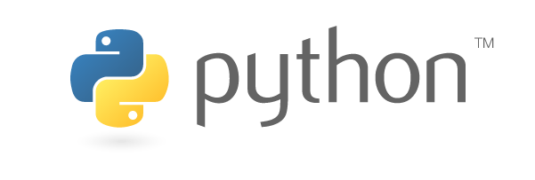

Modes in Mu
-----------

Mu is a modal editor: it behaves differently depending on the currently
selected mode. The name of the current mode is always displayed in the bottom
right hand corner of Mu's window. Clicking on the mode button opens up a dialog
box to allow users to select a new mode.

What Are Modes?
===============

Modes are a way to customise how Mu should behave. This simplifies Mu: rather
than trying to provide every possible feature at once (and thus become a
nightmare of complexity for the user), modes bring related features together in
a simple and easy to use manner.

Modes are able to add buttons to the user interface, handle certain events
(such as when one of the mode's buttons is clicked) and provide contextual
information for Mu (such as where files should be saved or what API metadata
is available). It's also possible for one mode to transition to another and
some modes are only available as transitional modes (i.e. they may not be
selected by the user). A good example of such a "transitional" mode is the
Python 3 debugger, which can only be accessed from the standard Python 3 mode.

Mu contains the following modes, although it is very easy to add more (the
images below are used with permission, see :doc:`copyright`).

Adafruit Mode
+++++++++++++

.. image:: circuit_playground.jpg

`Adafruit <http://adafruit.com/>`_ make extraordinarily awesome boards for
embedded development. Many of these boards run Adafruit's own flavour of 
`MicroPython <http://micropython.org/>`_ called
`CircuitPython <https://www.adafruit.com/circuitpython>`_.

The Adafruit mode
inherits from a base MicroPython mode that provides USB/serial connectivity to
the board. Because source code is stored directly on the Adafruit boards,
this mode ensures that filesystem based operations actually happen on the
connected device. If no such device is found, the mode will warn you.

BBC micro:bit Mode
++++++++++++++++++

.. image:: microbit.png 

The `BBC micro:bit <http://microbit.org/>`_ is a small computing device for
young coders that is capable of running MicroPython. Mu was originally created
as volunteer led effort as part of the Python Software Foundation's
contribution to the project.

Just like the Adafruit mode, micro:bit mode inherits from a base MicroPython
mode so there's a REPL based interface to the device. It also provides
functionality to "flash" (i.e. copy) your code onto the device and a simple
user interface to the simple file system on the device.

Pygame Zero / PyGame Mode
+++++++++++++++++++++++++

`PyGame <http://pygame.org/>`_ (or, more correctly: "pygame") is a cross
platform set of Python libraries for writing games.
`Pygame Zero <https://pygame-zero.readthedocs.io/en/stable/>`_ is a wrapper for
pygame that makes it easy for beginners to make games. If both pygame and
Pygame Zero are installed (as they are if you used the official Windows
installer), Mu's Pygame Zero mode makes it easy for beginner programmers to
create games.

This mode provides a "Play" button that uses Pygame Zero's game-runner to
launch the user's games. Two further buttons open the operating system's file
system explorer for the directories containing images and sounds used in the
user's games. This makes it easy for the user to copy and paste new game assets
into the right place.

The standard Python3 mode (see below) is probably a better environment for more
advanced pygame-only development. Mu ensures that all the game assets required
by the `Pygame Zero introductory tutorial <https://pygame-zero.readthedocs.io/en/stable/introduction.html>`_
are available by default.

Standard Python3 Mode
+++++++++++++++++++++

This mode is for creating simple Python 3 programs. As with the other modes,
there is a REPL for live programming, but in this case it is an iPython based
REPL that uses `project Jupyter <http://jupyter.org/>`_. As with other Jupyter
notebooks, it's possible to embed graphics and charts into the REPL so it
becomes a interesting to read and work with.

There are two ways to run your script in this mode:

1. Click the "Run" button: will launch the script using Python's interactive
   mode (so you'll be dropped into a basic interactive Python shell upon the
   script's completion).
2. Click the "Debug" button: Python mode transitions to the debug mode - a
   graphical way to inspect and watch your code execute.
   
Because of the overhead needed to start the graphical debugger it takes longer
to start running your script. This is especially noticeable on the Raspberry Pi.

Python 2 isn't supported by Mu and never will be.

Debug Mode
++++++++++

It's only possible to enter debug mode from standard Python mode. It's purpose
is to manage the execution and inspection of your code.

Clicking the margin of the editor toggles "break points" that tell the debugger
where to pause. Once paused it's possible to inspect the state of various
objects at that moment in the code's execution and step over, into and out of
lines of code. You're able to watch Python execute your code, allowing you to
discover where there may be bugs.

Once the code has finished the debug mode transitions back to standard
Python mode.

Create a New Mode
=================

It's very easy to create new mode for Mu. The following tutorial explains how
we created the Pygame Zero mode.

Create a Class
++++++++++++++

The most important aspects of a mode are encapsulated in a class that
represents the mode. These classes live in the ``mu.modes`` namespace and
**must** inherit from the ``mu.modes.base.BaseMode`` class. If your new mode
is for a MicroPython based device, you should inherit from the
``mu.modes.base.MicroPythonMode`` class, since this includes various helpful
utilities for such things as finding a connected device and running a REPL
over a USB-serial connection.

The naming convention is to create a new module in which is found the class
representing the mode. For example, for Pygame Zero, the new module is
``mu.modes.pygamezero`` in which is found the ``PyGameZeroMode`` class that
inherits form ``BaseMode``.

Integrate the Mode
++++++++++++++++++

Mu needs to know that the new mode is available to use. This is fulfilled by
a couple of relatively simple steps:

* Add the mode's class to the ``__all__`` list in the ``__init__.py`` file for
  the ``mu.modes`` namespace.
* In ``mu.app.py`` import the new mode from ``mu.modes`` and add an instance of
  the mode's class to the dictionary returned by the ``setup_modes`` function.
  (All modes are instantiated with the available ``editor`` and ``view``
  objects that represent the editor's logic and UI layer respectively.)

Update the Class's Behaviour
++++++++++++++++++++++++++++

The core elements of your new mode's class that need updating include some
attributes and three methods.

The attributes that must be changed are:

* ``name`` -- the full name of the mode, for example, "PyGame Zero".
* ``description`` -- a short description of the mode to be displayed in the
  mode picker. For example, "Make games with Pygame Zero".
* ``icon`` -- an icon used to represent the mode in the mode picker. This must
  be a ``.png`` image file found in the ``mu/resources/images`` directory.

Additional attritbutes with safe default values set in the ``BaseMode`` class
which may be of value for you to change are:

* ``save_timeout`` -- the number of seconds to wait before auto-saving work. If
  this value is 0 (zero) Mu will not auto-save changed files when in this mode.
* ``builtins`` -- a list of strings defining symbols that Mu's code checker
  must assume are builtins (above and beyond Python's standard builtins).

.. note::

    When creating strings that will be seen by users please remember to use
    the conventions for internationalization (i18n). Put simply, enclose your
    strings in a call to ``_`` like this::
    
    _('This string will be translated automatically')
    
    Please see :doc:`translations` for more details.

You should pay attention to three methods of your class: ``actions``,
``api`` and ``workspace_dir``. You must override ``actions`` and ``api`` (see
below) and *may* want to override ``workspace_dir``.

The purpose of the ``workspace_dir`` method is to return a string
representation of the path to the directory containing the code created with
this mode. The default implementation in ``BaseMode`` is generally safe to use
although some CircuitPython based boards may want to use this method to point
to a connected device (if attached) or a safe default on the user's filesystem
(if no device is attached). See how it's done in the ``AdafruitMode`` class.
If in doubt, just use the method inherited from ``BaseMode``.

However, you **must** override the ``actions`` method. It must return a list
of dictionaries that describe the buttons to be added to Mu's user interface.
Each dictionary must contain the following key/value pairs:

* ``name`` -- the name of the button which doubles as the name of the icon
  found in ``mu/resources/images`` used as the visual representation of the
  button. To create a new button start with the blank ``button.png`` image
  and use either an icon from the
  `FontAwesome <https://fontawesome.bootstrapcheatsheets.com/>`_ set of icons,
  or some other graphical device that looks visually similar. Make sure that
  the colour of the image is correct blue of (hex value) #336699. Please
  remember to centre it within the button and make sure it has the same sort
  of scale as the existing buttons.
* ``display_name`` -- the string displayed immediately underneath the button
  in Mu's user interface.
* ``description`` -- the string displayed as a tool-top when the mouse
  pointer hovers over the button, but the button remains unclicked.
* ``handler`` -- a reference to a method you have created in your mode's class
  that is called, with an event object, when the button is clicked.
* ``shortcut`` -- a string representation of the keyboard shortcut for the
  button. Valid examples include, ``'F5'`` (for function key 5) or,
  ``'Ctrl+Shift+I'`` (for control-shift-I).

By way of illustration, here's the list of dictionaries returned in the
Pygame Zero mode::

    [
        {
            'name': 'play', 
            'display_name': _('Play'),
            'description': _('Play your PyGame Zero game.'),
            'handler': self.play_toggle,
            'shortcut': 'F5',
        },
        {
            'name': 'images',
            'display_name': _('Images'),
            'description': _('Show the images used by PyGame Zero.'),
            'handler': self.show_images,
            'shortcut': 'Ctrl+Shift+I',
        },
        {
            'name': 'sounds',
            'display_name': _('Sounds'),
            'description': _('Show the sounds used by PyGame Zero.'),
            'handler': self.show_sounds,
            'shortcut': 'Ctrl+Shift+S',
        },
    ]

Notice how the handlers are references to methods of the ``PyGameZeroMode``
class, the details of which are left to the creator of the mode. Mu simply
calls the handler and expects the author of the mode to know what they're
doing.

Interactions with the Mu editor are via two objects referenced within the
class:

* ``self.editor`` -- represents an object containing the core logic of the
  editor (an instance of ``mu.logic.Editor``).
* ``self.view`` -- references the main GUI object through which all display
  and user interface related operations should pass (an instance of
  ``mu.interface.main.Window``).

Please see the :doc:`api` for specific details of what these two objects
offer.

Finally, you **must** also override the ``api`` method, whose role is to
provide a list of strings that conform to Scintilla's protocol for defining
and documenting API's to be used with autocomplete and call-tips. The protocol
is::

    'foo.bar(arg1, args2="baz") \nMulti line\n\nEnglish description.`

Happily, various scripts in the ``utils`` directory can be used, cloned and
modified to autogenerate this documentation from source code. The reason the
extraction of such API related information is automated is so it makes it
very quick and easy to revise such data as APIs change in the future.

Take a look at the ``pgzero_api.py`` file and you'll find a simple recipe for
extracting such information from Python modules. Three modules for Python's
standard library (``json``, ``inspect`` and ``importlib``) are used to import
the modules we're interested in, inspect the signatures of the callable objects
found therein and emit a JSON based output (called ``pgzero_api.json``).

The resulting JSON is a list of JSON objects containing three attributes:

* ``name`` -- the module name + object name.
* ``args`` -- a list of the arguments taken by the callable Python object
  being described.
* ``description`` -- the docstring associated with the Python object.

Here's an example of such an object from the emitted ``pgzero_api.json``
file::

    {
        "description": "Interface to the screen.",
        "name": "screen.Screen",
        "args": [
            "surface"
        ]
    }

Given such JSON serialised data, the ``mkapi.py`` command will take such a file
as input and emit to stdout a list of strings for the API that conform to
Scintilla's protocol to be used by autocomplete and call-tips.

In the case of the Pygame Zero mode, the output from the ``mkapi.py`` command
ended up in ``mu.modes.api.PYGAMEZERO_APIS``. The list itself is in the
``pygamezero.py`` file in the ``mu/modes/api`` directory, and the
``__init__.py`` found therein exposes it via the ``__all__`` list.

Back in the ``PyGameZeroMode`` class the ``api`` method simply returns a
concatenated list of the APIs that a user of the mode may use::

    from mu.modes.api import (PYTHON3_APIS, SHARED_APIS, PI_APIS,
                              PYGAMEZERO_APIS)

    ... later in the PyGameZeroMode class ...

    def api(self):
        return SHARED_APIS + PYTHON3_APIS + PI_APIS + PYGAMEZERO_APIS

With these relatively simple steps, it's possible to create quite powerful
modes. Most importantly, taking a look at the existing modes in the
``mu.modes`` namespace will reveal how to do most of the things you'll need.

However, there is one final aspect of creating a mode that we need to address.

Unit Test the Mode
++++++++++++++++++

**We will not accept any new modes without 100% unit test coverage.**

Please read the guide about :doc:`tests` for how Mu is tested and the various
expectations we have when it comes to writing tests.

If you are unsure about the best way to go about testing your mode please feel
free to ask for help. We would much rather get a pull request for a "spike"
(draft) version of a new mode and work with the original author on testing the
code, than have no pull request at all.

If in doubt, ask. We're a friendly bunch and :doc:`contributing` is easy.
