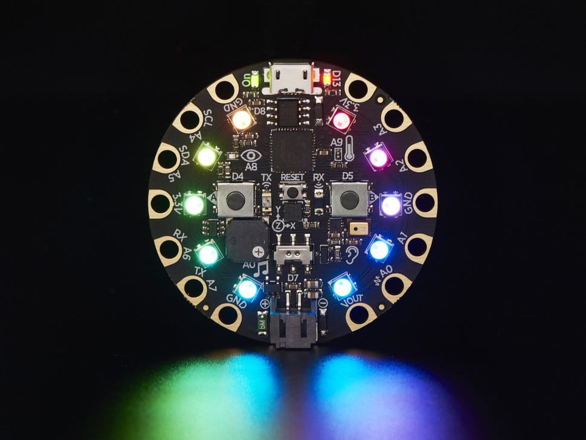

Modes in Mu
-----------

Mu is a modal editor: it behaves differently depending on the currently
selected mode. The name of the current mode is always displayed in the bottom
right hand corner of Mu's window. Clicking on the name of the current mode
opens up a dialog box to allow users to select a new mode.

What Are Modes?
===============

Modes are a way to customise how Mu should behave. This simplifies Mu: rather
than trying to provide every possible feature at once (and thus become a
nightmare of complexity for the user), modes bring related features together in
a simple and easy to use manner.

Modes are able to add buttons to the user interface, handle certain events
(such as when one of the mode's buttons is clicked) and provide contextual
information for Mu (such as where files should be saved or what API metadata
is available). It's also possible for one mode to transition to another and
some modes are only available as transitional modes (i.e. they may not be
selected by the user). A good example of such a "transitional" mode is the
Python 3 debugger, which can only be accessed from the standard Python 3 mode.

Mu contains the following modes, although it is very easy to add more.

Adafruit Mode
+++++++++++++

`Adafruit <http://adafruit.com/>`_ make extraordinarily awesome boards for
embedded development. Many of these boards run Adafruit's own flavour of 
`MicroPython <http://micropython.org/>`_ called
`CircuitPython <https://www.adafruit.com/circuitpython>`_.

The Adafruit mode
inherits from a base MicroPython mode that provides USB/serial connectivity to
the board. Because source code is stored directly on the Adafruit boards,
this mode ensures that filesystem based operations actually happen on the
connected device. If no such device is found, the mode will warn you. If the
mode detects a device in "bootloader mode" (tap the reset button three times
to enable this), then Mu can also flash the latest version of CircuitPython
onto your device.

BBC micro:bit Mode
++++++++++++++++++

The `BBC micro:bit <http://microbit.org/>`_ is a small computing device for
young coders that is capable of running MicroPython. Mu was originally created
as volunteer led effort as part of the Python Software Foundation's
contribution to the project.

Just like the Adafruit mode, micro:bit mode inherits from a base MicroPython
mode so there's a REPL based interface to the device. It also provides
functionality to "flash" (i.e. copy) your code onto the device and a simple
user interface to the simple file system on the device.

Standard Python Mode
++++++++++++++++++++

This mode is for creating simple Python 3 programs. As with the other modes,
there is a REPL for live programming, but in this case it is an iPython based
REPL that uses `project Jupyter <http://jupyter.org/>`_. As with other Jupyter
notebooks, it's possible to embed graphics and charts into the REPL so it
becomes a interesting to read and work with.

When you tell Mu to run your script the Python mode transitions to the debug
mode - a graphical way to inspect and watch your code execute.

Debug Mode
++++++++++

It's only possible to enter debug mode from standard Python mode. It's purpose
is to manage the execution and inspection of your code.

Clicking the margin of the editor toggles "break points" that tell the debugger
where to pause. Once paused it's possible to inspect the state of various
objects at that moment in the code's execution and step over, into and out of
lines of code. You're able to watch Python execute your code, allowing you to
discover where there may be bugs.

Once the code has finished the debug mode transitions back to standard
Python mode.

Create a New Mode
=================

It's very easy to create new mode for Mu. The following tutorial explains how
to create one for PyGameZero.
