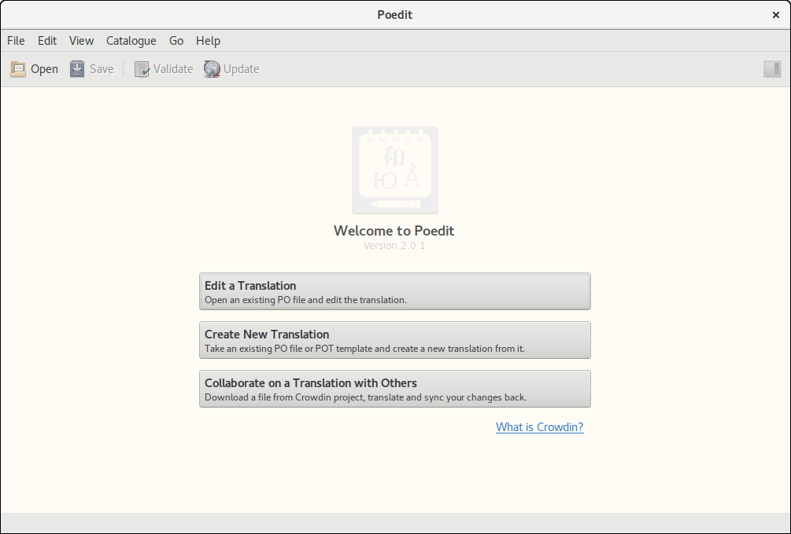
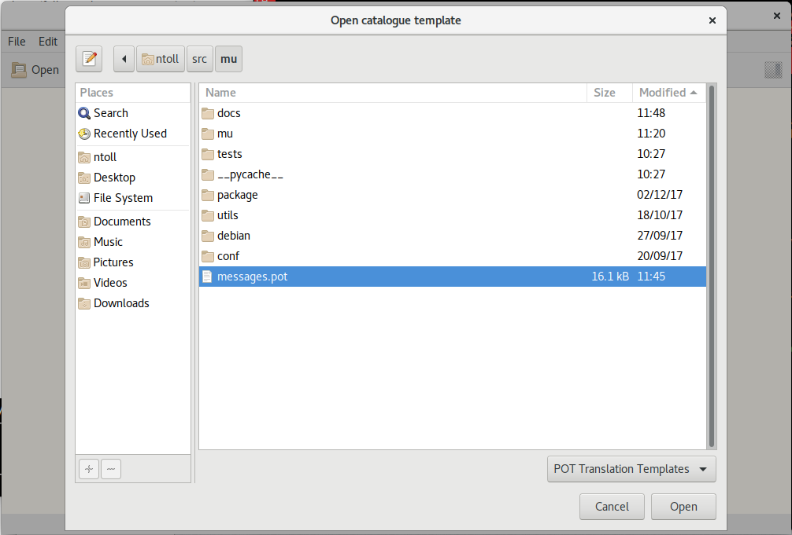
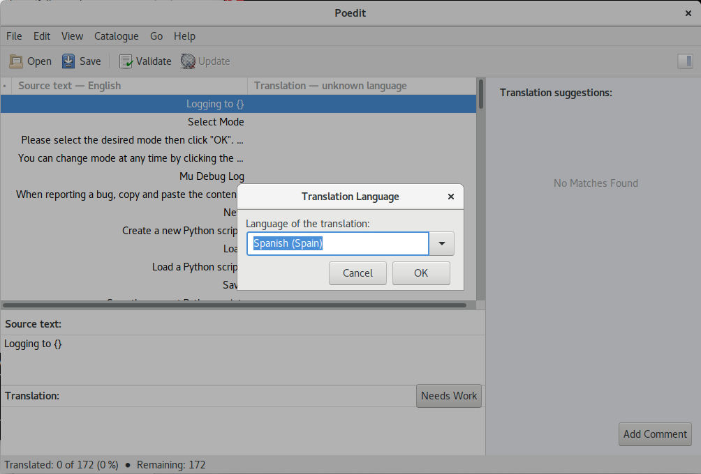
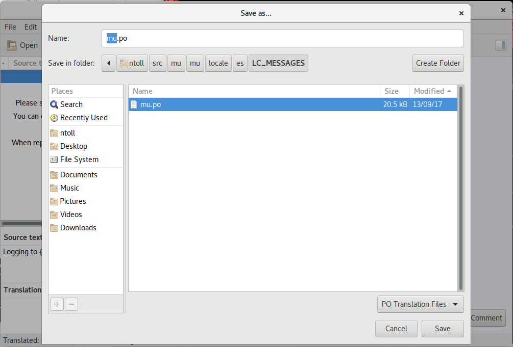

Internationalisation of Mu
==========================

A really useful and relatively simple way to contribute to Mu is to translate
the user interface into a different language. The steps to do this are very
simple and there exist plenty of tools to help you.

You can contribute in two ways:

* Improve or extend an existing translation.
* Create a completely new translation for a new locale.

In both cases you'll be using assets found in the ``mu/locale`` directory.

Mu uses Python's standard `gettext <https://docs.python.org/3.6/library/i18n.html>`_
based internationalization API so we can make use of standard tools to help
translators, such as `poedit <https://poedit.net/>`_.

To manually change the locale Mu uses for translation strings, look in
``mu/app.py`` for the following lines of code at the start of the file::

    # Configure locale and language
    # Define where the translation assets are to be found.
    localedir = os.path.join('mu', 'locale')
    # Use the operating system's locale.
    current_locale, encoding = locale.getdefaultlocale()
    # Get the language code.
    language_code = current_locale[:2]
    # DEBUG/TRANSLATE: override the language code here (e.g. to Spanish).
    # language_code = 'es'
    gettext.translation('mu', localedir=localedir,
                        languages=[language_code], fallback=True).install()

As the comment suggests, temporarily update the ``language_code`` to the target
language for translation, make your changes, as explained below, and re-run
Mu to check your updates are correct and appropriate for your target locale.

Improve an Existing Translation
-------------------------------

If you want to improve or extend an existing translation you should edit a file
called ``mu.po`` for the target locale. Such files for existing translations
are found in the ``mu/locale/<LOCALE>/LC_MESSAGES`` directory (remember to
replace ``<LOCALE>`` with the value for the locale's language / country code
combination `as specified by gettext convention <https://www.gnu.org/software/gettext/manual/html_node/Locale-Names.html>`_).

Open the ``mu.po`` file in an editor or translation tool of your choice (we
recommend `poedit <https://poedit.net/>`_ as a great solution for this). If
you're using a plain text editor, remember to make your changes to the message
string (``msgstr``) *not* the message id (``msgid``). 

Once you've saved and, most importantly, **checked your translation strings
appear as expected in Mu**, commit your changes and create a pull request via
GitHub. Alternatively, if you're not a technical user,
`create a new issue in GitHub <https://github.com/mu-editor/mu/issues/new>`_
and attach your ``mu.po`` file along with details of the locale.

Create a New Translation
------------------------

There are three steps to creating a new translation:

1. [Optional] Use ``make translate`` to create an up-to-date ``messages.pot`` file.
2. Use a tool like `poedit <https://poedit.net/>`_ to load the ``messages.pot`` file, select a language / locale and create appropriately translated messages.
3. Save the resulting ``mu.po`` file into the ``mu/locale/<LOCALE>/LC_MESSAGES`` directory, replacing ``<LOCALE>`` with the value for the locale's language / country code combination `as specified by gettext convention <https://www.gnu.org/software/gettext/manual/html_node/Locale-Names.html>`_.

Taking each in turn, you may (optionally) need to create an up-to-date
specification of all the strings found within Mu that need translating. This is
the ``messages.pot`` file and you simple need to issue the following command
to regenerate it::

    $ make translate

You'll see some output ending with the message::

    New messages.pot file created.
    Remember to update the translation strings found in the locale directory.

To create a new translation you'll need to use a tool such as
`poedit <https://poedit.net/>`_ to load the ``messages.pot`` and configure
output for a new locale. The resulting output is a ``mu.po`` file that needs
to be saved in the ``mu/locale/<LOCALE>/LC_MESSAGES`` directory, replacing
``<LOCALE>`` with the value for the new locale's language / country code
combination
`as specified by gettext convention <https://www.gnu.org/software/gettext/manual/html_node/Locale-Names.html>`_.

This process is illustrated below, with the cross-platform and open-source
`poedit <https://poedit.net/>`_ tool.

Create New Translation
++++++++++++++++++++++

Select ``messages.pot``
+++++++++++++++++++++++

Specify the New Locale
++++++++++++++++++++++

At this point, simply use `poedit <https://poedit.net/>`_ to fill in the
translated messages from the source messages.

Save ``mu.po`` when Finished
++++++++++++++++++++++++++++

.. note::

    Please make sure you check your translation is appropriate and correct for
    your target before submitting your work.

