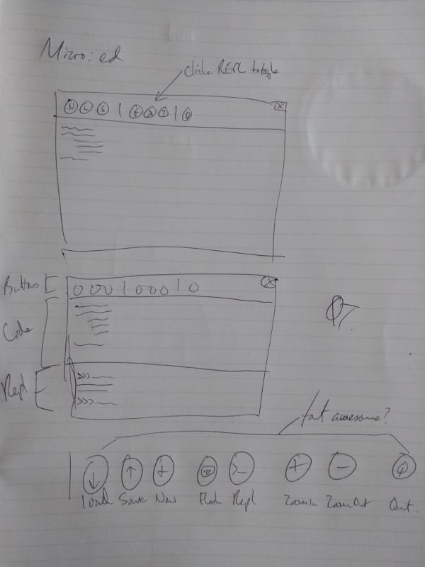

User Experience
---------------

We care deeply about all our users - we want using Mu to be a positive
experience. In particular we focus on our primary users:

* Beginner programmers,
* Those who support beginner programmers.

They are at the centre of all Mu related development.

In order to understand how Mu can best support our users we need to learn about
their needs, world view and how this reflects upon and influences their
experience of using Mu (hence the name of this section).

This includes taking into account cultural differences, special educational
needs, level of education and other aspects of a person's life that may impact
on their accessibility to technology.

These are not problems to be "solved". Rather, this illustrates that Mu is an
application to be evolved in a way to inclusively address the needs of users.
As a result, it is important to keep Mu simple so that it is easy to make the
inevitable changes needed. It's also important to point out that we will make
mistakes and may need to revise how Mu works. Therefore Mu should be simple
enough that it is easy to fix.

It's important to differentiate between design and usability. Plenty of
software looks beautiful but is difficult to use. With Mu, we aim to put
usability and a great experience before looks.

This beautiful yet inconvenient wine glass from
`the uncomfortable <https://www.theuncomfortable.com/>`_ illustrates what I
mean (used with permission, see :doc:`copyright`).

What is UX?
===========

I have some wonderful friends in the tech world and one in particular,
`Ann Carrier <https://twitter.com/pixeldiva>`_,  was kind enough to explain
her work in "user experience" which I'll reproduce below. It beautifully
captures how I'd like user experience to relate to Mu. I sent her a series of
questions to help me understand what I needed to do to bring about great UX in
Mu and Ann gave some great answers.

What is UX and why is it important / useful?

    UX is short for User Experience. User Experience means the overall
    experience of a person using a product such as a website or computer
    application, especially in terms of how easy or pleasing it is to use.

    It's a really important part of the process of creating a product for
    people to use. It focuses on finding out about the needs of the people who
    will be using the product or service. This can also include how they
    behave, or what they do right now to achieve whatever it is they need to
    do. Once you understand this, you can then go about the process of
    designing something to meet those needs. You can even include users in the
    process through interviews, usability assessments or other workshops. There
    is absolutely nothing better than seeing people use a thing you've designed
    to help you figure out all the things you haven't quite got right!

Can you describe the processes and techniques you use as part of your job?

    I start with research. That takes many forms. Whether it's desk research
    into the latest apps or design patterns, or into the other products in the
    area we want to build a product in, or speaking to the people who are going
    to be using the product, this stage is vital.

    Once we have a better idea of the problem we're trying to solve, and the
    context which surrounds that problem, we can begin to try and solve it.
    There are many ways to do this, but I always find it helpful to draw things
    out. This is especially helpful when you're working in a team. Having a
    diagram (even if it's just boxes, lines and dodgy handwriting) that
    everyone can see and suggest changes to helps you know that everyone has a
    shared understanding.

    Once we have a shared understanding of the problem, and if there is one,
    the current workflows or processes we can then begin to look ahead to how
    this thing could work, in a magical perfect world that in reality, rarely
    exists. When we have this, we can then look at what steps we are going to
    take to get there. This allows us to have a firm "North Star" in mind, and
    with every step, re-assess not only whether that's the same direction we
    want to keep going in, but whether or not any solutions will take us closer
    towards, or further away from it. At this stage, we can and should also
    write down the success criteria - in other words, how will we know this is
    working?

    Next up is sketching out ideas for how the interface will look. Coming up
    with lots of ideas at this point is really useful. The first idea you have
    is rarely the best, so it's good to try and get a lot of ideas on to paper
    so that you can figure out the best ones. One technique you can use is to
    try to come up with 6 different solutions to a problem. And if you're
    struggling to come up with all 6, then try things like solving the problem
    the opposite way to the last idea, or something completely wacky. It's
    amazing how useful this can be. Sometimes, the right idea is just a tiny
    bit to the side of the absolutely wrong way of doing a thing.

    Sketching doesn't need to be just done by designers, and you certainly
    don't need to be an artist. As long as you can draw boxes and arrows, and
    your handwriting is neat enough that you can read it afterwards, you're
    good. The point of a sketch is to communicate an idea. If everyone you're
    working with can understand what you're trying to describe with the sketch,
    then that's all it needs to do.

    Once you've got more of an idea of what the solution will be, and talked
    that over with anyone who needs to be involved (Product Managers,
    Engineers, Testers, Users) then you can move on to more high fidelity
    designs. These are called mockups and they show what the user interface
    could look like, once it's been built. Even at this stage, changes - known
    as iterations - can and will still happen, because at every point you're
    finding out more and more and refining your idea, until you get to the
    point where it's built and in the hands of your users.

How does your UX work fit in with the wider software development project?

    In a good team, UX people are involved the whole way through, from the
    first ideas, through research, exploration of solutions right to the end
    when the product is out in the world. That said, user experience isn't just
    the responsibility of people with UX in their job titles. Everyone has a
    part to play in delivering a good user experience to the people using the
    product.

What advice would you give to people doing UX for the first time?

    If a good carpenter's rule is "measure twice, cut once" a good rule for UX
    people is "listen more than you talk". Do your research. Find out about the
    people who will be using the product. What they need. What they want. What
    problems they've currently got. How they work. Then keep talking to them as
    you design and build.

Is there anything else we should know about UX that's not been covered by your
answers to the above?

    There's a great Shaker proverb which says:

        "Don't make something unless it is both made necessary and useful;
        but if it is both necessary and useful, don't hesitate to make it
        beautiful."

    This gives you a great set of questions to ask of yourself whenever you're
    approaching a project.

    Necessary:

    1. what problem are we trying to solve?
    2. is the proposed solution needed (can it be solved a different way?)
    3. will it solve the problem?

    Useful (and usable):

    4. does the solution solve the problem for the people who need it?
    5. does it work well?

    Beautiful:

    6. does it look good? (beautiful things make people happy!)

UX and Mu
=========

The "story so far" of Mu and UX starts with Carrie Anne Philbin's (director of
education at the Raspberry Pi Foundation)
`keynote address to EuroPython 2015 <https://www.youtube.com/watch?v=_gU7sfTrz4c>`_.
This formed the basis for usability decisions when Mu was first created. While
running workshops to test a browser based editor for the BBC's micro:bit, we'd
heard from teachers that while the browser was very convenient in terms of
setting things up, it was a pain to have to continually download scripts and
then copy them onto the device and they also wanted easy access to
MicroPython's REPL. I wondered "how hard can it be?" and set out to create an
editor based on Carrie Anne's comments about the needs of teachers and learners
when it came to code editing.

Halfway into the keynote Carrie Anne talks about a development
environments for beginner programmers in Python:

.. raw:: html

    

        <iframe width="560" height="315" src="https://www.youtube-nocookie.com/embed/_gU7sfTrz4c?rel=0&amp;start=2002" frameborder="0" allow="autoplay; encrypted-media" allowfullscreen></iframe>
    

She starts by explaining the problems with online editors. Often they require
users to sign up, thus excluding a large number of children who, for legal
(child protection) reasons, are not allowed to sign up because they have not
reached the minimum age (usually around 14 years old) for them to be allowed to
create their own accounts. Online editors introduce bureaucratic problems too:
often schools use a "whitelist" system with their firewalls - they block
everything except those sites on the whitelist. Getting a site onto the
school's whitelist is often an onerously bureaucratic and slow task.
Furthermore, assuming the website is available, many online editors expect
their users to have access to modern hardware and browsers. This is often not
the case and intractable technical problems result. Finally, a significant
minority of children still don't have access to the internet, even in
relatively advanced countries like the UK. For these reasons, a native
developmnet environment is preferred.

Carrie Anne then explores two offerings for students to use as native code
editors.

PyCharm has an educational edition that is both free and open. However, Carrie
Anne claims it's not very obvious for either beginner developers or teachers
how best to use the application. She mentions there are too many opportunities
for users to fail because of the plethora of buttons and menus. As a teacher,
she wants something simple and obvious.

Next, she turns her attention to Idle - the editor that comes bundled with
Python. It's good that Idle is free, has some syntax highlighting, auto-indents
Python code, is cross platform, leightweight and simple. However, there are no
line numbers, error reporting is incomrehensible to beginners and, most
importantly, there are two separate windows that often get lost or confused
with each other (one for code, the other for a sort of REPL).

She suggests we turn out attention to a project called `SonicPi <http://sonic-pi.net/>`_,
a sort of programmable music tool for the Raspberry Pi, as an example of the
sorts of features teachers and learners desire in a coding environment. She
enumerates features that may not immediately seem important for beginner
programmers and teachers.

* All the panels are in the same window and it's obvious what each one does.
* There's built-in help.
* There are a limited number of obviously named buttons that encompass the core
  tasks required of the user.
* Zooming in and out is a killer feature for teachers.
* Simple things like line numbers and help for aligning code make a huge
  difference.

Finally, she challenges the audience by asking, "Why can't we have something
like that for Python?" Being of a teacher-ish disposition she sets the
assembled conference homework to be due in 2016.

When I started work on Mu I watched the video mentioned above and sketched a
rough outline of how Mu might work in terms of usability, reproduced below.

Notice that while the details are obviously different, the core interface looks
like Mu (if you're wondering what "micro:ed" refers to - it was Mu's original
name until the BBC got shirty about it and I changed it to Mu). I simply took
Carrie Anne's suggestions and made the simplest thing possible.

Since then I've interviewed many teachers, observed lots of lessons and
workshops and gathered feedback from users online. Changes to the usability of
Mu generally follow a pattern:

* We find evidence of several people wanting a change to make their lives
  easier (we tend to ignore single case exacmples of desired changes).
* We use our issue tracking system built into GitHub as a way to come up with a
  tangible plan.
* We create the simplest possible solution and ask for feedback.
* Iterate!

Resources for UX
================

In addition to providing answers about UX, Ann very kindly pointed me to
various resources on the web that helped me to understand the challenges and
work needed to do actionable UX research.

Andrew Travers has 
`blogged about <https://web.archive.org/web/20210516205833/https://trvrs.co/book/>`_
a free pocket guide he has written on
`interviewing for research <https://s3-eu-west-1.amazonaws.com/interviewing-for-research/InterviewingForResearch.pdf>`_.
I found this invaluable reading and helped me to prepare for the observations
and interviews I conducted as part of the process of developing Mu. This is
where I would start if I were new to UX research and wanted to get a quick
overview of things to do.

The Government Digital Service of the UK Government has an international
reputation for software development greatness. The foundation of this
reputation are the documents it releases, for free, that outline the "best
practices" and expectations about process that GDS have about various aspects
of the software development process. Their
`service manual on user research <https://www.gov.uk/service-manual/user-research>`_
is a comprehensive outline of the various tasks, processes and outcomes needed
to do effective UX research. I particularly found the section on
`analysis of UX research <https://www.gov.uk/service-manual/user-research/analyse-a-research-session>`_ helpful.

Finally, it's good to read the suggestions, heuristics and best practice for
working with users who have additional requirements when using software. Again,
the UK government's GDS has a number of resources, although I found this blog
post on the
`Dos and don'ts on designing for accessibility <https://accessibility.blog.gov.uk/2016/09/02/dos-and-donts-on-designing-for-accessibility/>`_
(and the associated posters) to be a rich seam of useful advice. All their
resources in this context can be found on their page about
`accessibility and assisted digital <https://www.gov.uk/service-manual/helping-people-to-use-your-service>`_.

Mu has a long way to go on its path to being an inclusive and accessible code
editor, but what is certain is that UX is a core driver of this journey.
